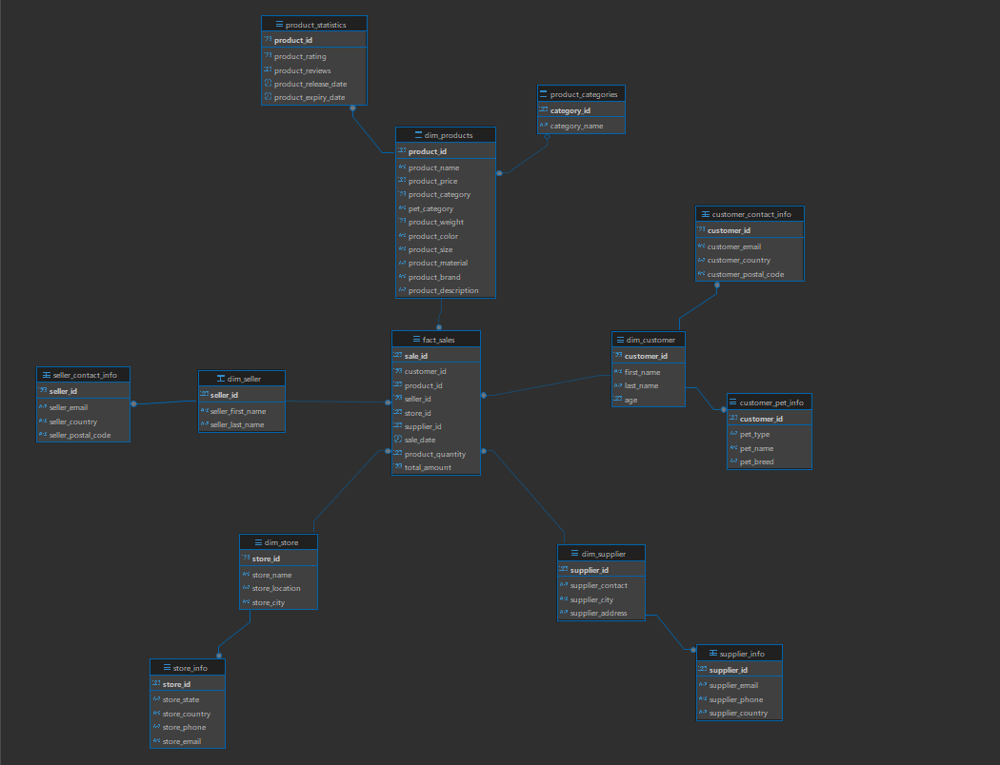

# Документация ETL-процесса

## Обзор
Этот документ описывает двухфазный ETL-процесс:
1. Трансформация исходных данных в схему "снежинка" в PostgreSQL
2. Генерация аналитических витрин данных в различных хранилищах

## Архитектура процесса

### Фаза 1: Трансформация в схему "снежинка"
Первая фаза (`transform`) выполняет следующие задачи:
- Извлечение данных из исходной таблицы `mock_data`
- Преобразование данных в нормализованную структуру
- Загрузка данных в PostgreSQL в виде схемы "снежинка"
- Создание связей между таблицами для обеспечения целостности данных

### Фаза 2: Генерация витрин данных
Вторая фаза включает создание аналитических витрин в различных хранилищах:
- ClickHouse: для быстрой аналитики и агрегаций
- MongoDB: для документо-ориентированных отчетов
- Cassandra: для колоночных аналитических запросов
- Neo4j: для графовых аналитических отчетов
- Valkey: для кэширования часто используемых данных

## Структура базы данных


## Процесс трансформации данных

### Фаза 1: Трансформация в PostgreSQL
1. Извлечение данных из `mock_data`
2. Преобразование типов данных
3. Создание таблиц измерений
4. Создание вспомогательных таблиц
5. Создание таблиц контактной информации
6. Создание фактовой таблицы
7. Установка связей между таблицами

### Фаза 2: Генерация витрин данных
После создания схемы "снежинка" в PostgreSQL, запускаются следующие задачи:

#### 1. Витрины в ClickHouse
- Агрегированные данные по продажам
- Аналитика по продуктам
- Отчеты по эффективности продавцов

#### 2. Витрины в MongoDB
- Документо-ориентированные отчеты
- Детальная информация о продуктах
- История продаж в JSON-формате

#### 3. Витрины в Cassandra
- Временные ряды продаж
- Аналитика по регионам
- Статистика по категориям

#### 4. Витрины в Neo4j
- Графовые связи между клиентами и продуктами
- Анализ цепочек продаж
- Визуализация связей

#### 5. Витрины в Valkey
- Кэширование популярных отчетов
- Быстрый доступ к агрегированным данным
- Временное хранение промежуточных результатов

## Порядок запуска

### 1. Подготовка окружения
```bash
./mvnw clean package -DskipTests
docker-compose up --build -d
```

### 2. Импорт тестовых данных
- Подключитесь к PostgreSQL
- Импортируйте данные из папки `mock_data`

### 3. Запуск трансформации
```bash
docker exec -it spark-submit /bin/bash
bash /opt/bitnami/spark/run-spark-job.sh transform
```

### 4. Генерация витрин данных
После успешной трансформации запустите задачи создания витрин:
```bash
# Витрины в ClickHouse
bash run-spark-job.sh reports-clickhouse

# Витрины в MongoDB
bash run-spark-job.sh reports-mongo

# Витрины в Cassandra
bash run-spark-job.sh reports-cassandra

# Витрины в Neo4j
bash run-spark-job.sh reports-neo4j

# Витрины в Valkey
bash run-spark-job.sh reports-valkey
```

## Заключение

В рамках проекта реализована комплексная система обработки и анализа данных о продажах товаров для животных. Основные достижения проекта:

1. **Архитектурные решения:**
   - Реализована схема "снежинка" в PostgreSQL для хранения нормализованных данных
   - Создана система витрин данных в различных специализированных хранилищах
   - Обеспечена целостность данных через систему внешних ключей

2. **Технологические инновации:**
   - Использование Apache Spark для эффективной обработки больших объемов данных
   - Применение различных типов баз данных для оптимизации различных типов запросов
   - Реализация кэширования для ускорения доступа к часто используемым данным

3. **Бизнес-ценность:**
   - Возможность быстрого анализа продаж по различным измерениям
   - Гибкая система отчетности с использованием специализированных хранилищ
   - Поддержка различных типов аналитики (временные ряды, графовые связи, документ-ориентированная)

4. **Масштабируемость:**
   - Контейнеризация всех компонентов системы
   - Возможность горизонтального масштабирования
   - Модульная архитектура, позволяющая добавлять новые источники данных

5. **Оптимизация производительности:**
   - Эффективное использование кэширования
   - Оптимизация запросов для каждого типа хранилища
   - Параллельная обработка данных в Spark

Проект демонстрирует современный подход к построению аналитических систем, сочетающий различные технологии для достижения оптимальной производительности и гибкости в анализе данных.